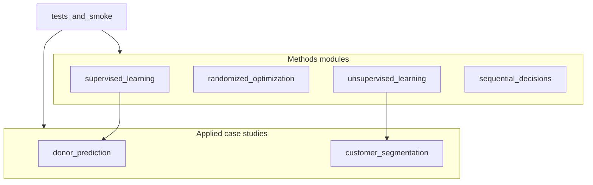

# Classical ML Lab

**One coherent classical machine learning laboratory** — supervised learning, randomized optimization, unsupervised learning / dimensionality reduction, and sequential decisions (MDPs / Q-learning) — plus two applied business case studies (donor prediction and customer segmentation).

Standalone CharityML / Azdias repos are archived pointers — see [`docs/MIGRATION.md`](docs/MIGRATION.md).

## Project overview

| Area | Path | What you learn / demonstrate |
|------|------|------------------------------|
| Supervised learning | [`supervised_learning/`](supervised_learning/) | SVM, NN, kNN, DT, boosted trees on Breast Cancer + Titanic |
| Randomized optimization | [`randomized_optimization/`](randomized_optimization/) | RHC, SA, GA, MIMIC on FlipFlop / Knapsack / TSP + NN weight search |
| Unsupervised + DR | [`unsupervised_learning/`](unsupervised_learning/) | k-means, EM, PCA, ICA, random projection, feature selection |
| Sequential decisions | [`sequential_decisions/`](sequential_decisions/) | Value / policy iteration + Q-learning on Frozen Lake & Forest MDPs |
| Donor prediction (case) | [`case_studies/donor_prediction/`](case_studies/donor_prediction/) | Income >$50K classification for outreach prioritization (F-beta) |
| Customer segmentation (case) | [`case_studies/customer_segmentation/`](case_studies/customer_segmentation/) | PCA + K-Means look-alike segments for mail-order targeting |

## Business problem

Classical ML still powers production decisioning: who to contact, which segments to target, how to search combinatorial spaces, and how to act under uncertainty. This lab shows **method depth** and **applied framing** without claiming fabricated business metrics.

## Solution

1. **Methods track** — controlled algorithm comparisons with documented tradeoffs (accuracy, runtime, overfitting).
2. **Case studies** — end-to-end notebooks with clear business objectives, metrics, and product tradeoffs.
3. **Runnable verification** — pytest + smoke script so clones can prove the lab works.

## Architecture



## ML methodology

- **Supervised:** train/test splits, grid search, F1 / accuracy / AUC comparisons across learners.
- **Optimization:** randomized search of discrete landscapes; NN weights via RHC/SA/GA vs gradient descent.
- **Unsupervised:** clustering + DR pipelines; interpretability vs compression tradeoffs.
- **MDPs / RL:** planning (VI/PI) vs learning (Q-learning); gamma / alpha / episode sensitivity.
- **Cases:** precision-oriented F-beta for outreach; PCA+K-Means for segment affinity.

## Product decisions and tradeoffs

- One repo (not three overlapping sklearn pins) so a recruiter sees a single classical-ML story.
- Methods modules keep algorithm-comparison depth; case studies carry business narrative.
- Sequential-decision work here is pedagogical MDPs; production trading RL lives in a separate quant research lab when present.
- Non-redistributable demographics extracts are bootstrapped to schema-compatible smoke CSVs.

## Results (headline)

- Supervised methods: breast-cancer classifiers reach high F1; Titanic is harder (class imbalance / weaker features) — see [`supervised_learning/docs/analysis.md`](supervised_learning/docs/analysis.md).
- Donor case: ensemble models beat Naive Bayes on F-beta when precision is prioritized — see case README.
- Segmentation case: runnable PCA→K-Means pipeline on smoke or full extracts — see case README and tests.

## Technologies

Python 3 · pandas · NumPy · scikit-learn · matplotlib · seaborn · Jupyter · mdptoolbox-hiive · gymnasium · pytest · (optional) mlrose-hiive

## Repository layout

```
classical-ml-lab/
├── README.md
├── LICENSE
├── requirements.txt
├── scripts/smoke.sh
├── supervised_learning/
├── randomized_optimization/
├── unsupervised_learning/
├── sequential_decisions/
├── case_studies/
│   ├── donor_prediction/
│   └── customer_segmentation/
└── tests/
```

## Installation

```bash
cd classical-ml-lab
python3 -m venv .venv
source .venv/bin/activate
pip install -r requirements.txt
# Optional (randomized optimization runners; prefer Python 3.10–3.12):
# pip install -r requirements-ro.txt
```

## Usage

```bash
# Verify layout, data, and case-study pipelines
chmod +x scripts/smoke.sh && ./scripts/smoke.sh

# Methods notebooks
jupyter notebook supervised_learning/notebooks/supervised_comparison.ipynb
jupyter notebook unsupervised_learning/notebooks/unsupervised_dimensionality.ipynb

# Case studies
jupyter notebook case_studies/donor_prediction/notebooks/finding_donors.ipynb
python case_studies/customer_segmentation/scripts/bootstrap_data.py
jupyter notebook case_studies/customer_segmentation/notebooks/customer_segments.ipynb

# Randomized optimization / MDPs (scripts; may take a long time for full runs)
# python randomized_optimization/ff.py
# python sequential_decisions/run.py
```

## Example outputs

- Learning curves and metric tables in methods analysis docs.
- Donor feature-importance charts and F-beta scorecards in the donor notebook / HTML export.
- PCA variance curves and population-vs-customer cluster mix in the segmentation notebook.
- Optimization fitness curves under `randomized_optimization/assets/`.
- MDP policy / value maps under `sequential_decisions/assets/`.

## Future improvements

- Packaged `src/` training CLIs that emit metrics JSON for CI.
- Faster smoke modes for RO / MDP full experiment suites.
- Calibrated probabilities and cost-sensitive thresholds for the donor case.

## License

All Rights Reserved. See [LICENSE](LICENSE).

## Portfolio pins

Recommended GitHub profile pin order for this portfolio family: see [`docs/PIN_STRATEGY.md`](docs/PIN_STRATEGY.md).
